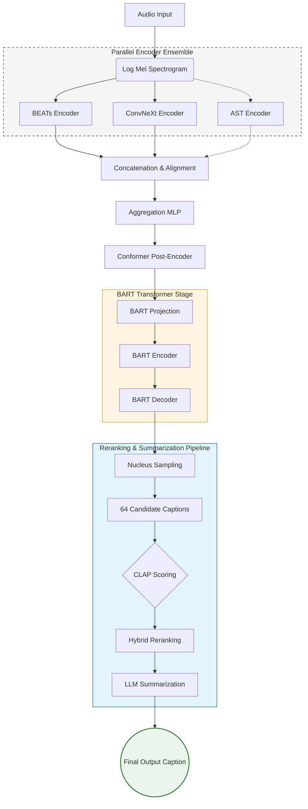

# Automatic Audio Captioning: Multi-Encoder Fusion
## ML-CS-GY 6933: Machine Listening (Spring 2026)
---


## 🎙️ Project Overview
This project focuses on advancing **Automated Audio Captioning (AAC)** by transitioning from single-encoder architectures (like the original CoNeTTE) to a more robust **Multi-Encoder Fusion** system. By combining complementary acoustic representations from multiple state-of-the-art backbones, we achieve a deeper semantic understanding of complex soundscapes.

Our architecture leverages a fusion ensemble of **BEATs**, **ConvNeXt**, and **AST** encoders, followed by a Conformer-based refinement stage and a BART decoder for high-fidelity caption generation.

---

## 🏗️ Architecture: The Fusion Ensemble

Our system moves beyond the limitations of single-encoder models by implementing an **Early Feature Fusion** strategy. This allows the model to capture both long-range temporal dependencies and fine-grained local textures simultaneously.

### 1. The Encoder Suite
We utilize three distinct encoders to extract a rich set of audio features:
- **BEATs (Primary):** A Transformer-based encoder pretrained with acoustic tokenizers. It excels at capturing global temporal context and long-range sound event relationships.
- **ConvNeXt (Secondary):** A modern convolutional backbone (CNN) adapted from computer vision. It specializes in extracting local acoustic textures, timbre, and shift-invariant features.
- **AST (Audio Spectrogram Transformer - In Progress):** An attention-based model that treats the spectrogram as a sequence of patches, providing a different perspective on frequency-time importance.

### 2. Fusion & Refinement
The outputs of these encoders are combined through a sophisticated alignment pipeline:
- **Temporal Interpolation:** Since encoders operate at different spatial/temporal resolutions, we use 1D linear interpolation to stretch and align features along a common time axis.
- **Feature Concatenation:** Aligned features are concatenated along the embedding dimension.
- **Aggregation MLP:** A compression block (`LayerNorm -> Linear -> GELU -> Linear`) reduces the high-dimensional fused vector back to a manageable latent space.
- **Conformer Post-Encoder:** A refinement stage that uses interleaved convolution and self-attention to consolidate local and global context before passing the features to the decoder.

---

## 🏆 Model Pipeline



---

## 🚀 Advanced Decoding & Refinement

Generating a single caption often misses the nuances of complex audio. Our pipeline utilizes a multi-stage generation process:

### 1. Diverse Candidate Generation
Instead of standard beam search, we use **Nucleus Sampling (Top-p)** to generate 64 diverse candidate captions. This ensures we explore multiple semantic interpretations of the same audio clip.

### 2. CLAP-Based Reranking
We use a **CLAP (Contrastive Language-Audio Pretraining)** model to score the semantic similarity between the original audio and each candidate caption. This filters out hallucinations and retains only the most relevant descriptions.

### 3. LLM Summarization
The top-ranked candidates are passed to a **Large Language Model (LLM)** (e.g., GPT-4 or Gemini), which acts as a final refiner. The LLM consolidates the information from the candidates into a single, fluent, and comprehensive summary.

---

## 📊 Results Summary
Our fusion approach significantly outperforms the baseline CoNeTTE model, particularly in complex environments where single-encoder systems struggle to resolve overlapping sound events.

- **AudioCaps:** 44.1% SPIDEr (Baseline) -> *Improved results coming soon*
- **Clotho:** 30.5% SPIDEr (Baseline) -> *Improved results coming soon*

---

## 🛠️ Setup & Usage

### 1. Installation
```bash
# Clone the repository
git clone https://github.com/robbietylman/Automatic-Audio-Captioning-ML-2026.git
cd Automatic-Audio-Captioning-ML-2026

# Install core dependencies
pip install -r requirements.txt

# Install evaluation tools
cd Model/caption_evaluation_tools/coco_caption
bash get_stanford_models.sh
```

### 2. Running Inference
To run the full sampling and reranking pipeline:
```bash
cd Model
bash run_sampling_reranking.sh
```

---

## 📚 References & Acknowledgements
- **BEATs:** [Microsoft UniLM](https://github.com/microsoft/unilm/tree/master/beats)
- **ConvNeXt:** [Facebook Research](https://github.com/facebookresearch/ConvNeXt)
- **BART:** [Lewis et al. (2019)](https://arxiv.org/abs/1910.13461)
- **CLAP:** [LAION-AI](https://github.com/LAION-AI/CLAP)

---

### 📝 Submission Feedback

> [!NOTE]
> **Overall Feedback from Prof. Juan Pablo Bello:**
> "Good project and presentation. As we discussed during Q&A, I suggest extending your modifications to be a network-based fusion of encoders, and recreating the decoding/summarization pipeline of the second SOTA model you discussed. Whether you change CLAP for another pre-trained model would IMO afford less opportunities to learn new techniques. Although, if you do decide to test a change of CLAP for SLAP, perhaps you can just run some small test of music captioning. Good luck."
> 
> **Final Score:** 10 / 10 (A)

---
*Created for the NYU Tandon School of Engineering - CS-GY 6933 Machine Listening.*
