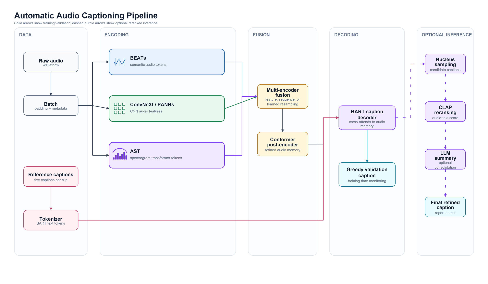
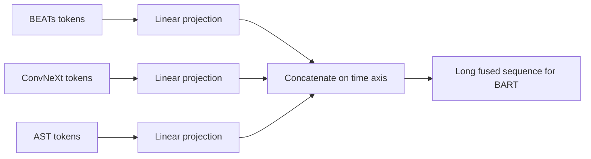
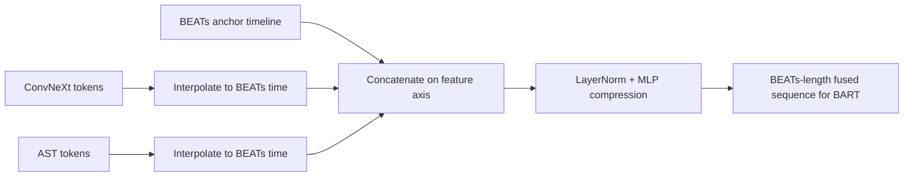
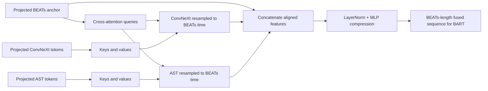

# Automatic Audio Captioning with Multi-Encoder Fusion

Automatic audio captioning is the task of generating a natural-language
description for an audio clip. Instead of predicting only a fixed sound class,
an audio captioning system should describe the audible scene in context: the
events present, their relationships, and sometimes the environment or activity
implied by the sound. For example, a model might turn a recording of footsteps,
traffic, and speech into a sentence such as "people are walking and talking near
a busy street."

This repository contains a PyTorch Lightning codebase for automatic audio
captioning on Clotho-style datasets. The current model combines pretrained
audio encoders with configurable fusion modules, a Conformer post-encoder, and
a BART-based caption decoder.

The implementation is organized as an experimental training scaffold for
Machine Listening research. Model components are selected through YAML
configuration files, making it straightforward to compare encoder combinations
such as BEATs + ConvNeXt, BEATs + AST, and BEATs + ConvNeXt + AST.

## Current Capabilities

- Clotho-compatible audio/caption data loading.
- Raw waveform batching with caption tokenization through Hugging Face
  tokenizers.
- Pretrained BEATs encoder support.
- Optional ConvNeXt/PANNs-style audio encoder branch.
- Optional AST encoder branch.
- Configurable multi-encoder fusion:
  - feature fusion with temporal alignment,
  - sequence concatenation fusion,
  - learned cross-attention resampling fusion.
- Conformer post-encoder for audio representation refinement.
- BART caption decoder with greedy validation-time generation.
- PyTorch Lightning training loop with TensorBoard or Weights & Biases logging.
- Lightweight validation metrics for monitoring BLEU, ROUGE-L, and generation
  length during training.

## Repository Layout

```text
.
|-- configs/
|   |-- all_together.yaml
|   |-- baseline_dcase24.yaml
|   |-- beats_ast.yaml
|   |-- beats_convnext.yaml
|   `-- beats_convnext_no_zero_init.yaml
|-- scripts/
|   `-- train.py
|-- src/aac_baseline/
|   |-- data/
|   |   |-- collators.py
|   |   |-- datamodule.py
|   |   `-- datasets.py
|   |-- models/
|   |   |-- captioner.py
|   |   |-- decoder.py
|   |   |-- fusion.py
|   |   |-- postencoder.py
|   |   `-- encoders/
|   `-- training/
|       |-- callbacks.py
|       |-- freezing.py
|       |-- lightning_module.py
|       `-- metrics.py
|-- requirements.txt
`-- README.md
```

## Architecture

The top-level model is implemented in
`src/aac_baseline/models/captioner.py` as `DCASE24BaselineCaptioner`.

At a high level, each training batch follows this path:

```text
raw waveform
  -> active audio encoder branches
  -> fusion module
  -> Conformer post-encoder
  -> BART caption decoder
  -> caption tokens
```



The solid path shows the implemented training and validation flow. The dashed
path shows the intended extended inference pipeline: sample multiple candidate
captions with nucleus sampling, rerank them with CLAP audio-text similarity, and
use an LLM to consolidate the strongest candidates into a final caption.

### Encoder Branches

BEATs is the required anchor encoder. ConvNeXt and AST are enabled only when
their configuration blocks are present in the selected YAML file. This keeps
experiments explicit and avoids changing code when comparing encoder sets.

The active branches are built in a fixed order:

1. `beats_encoder`
2. `convnext_encoder`, if configured
3. `ast_encoder`, if configured

The model requires at least two encoder branches because this codebase is
focused on fusion experiments.

### Fusion Modules

Fusion behavior is implemented in `src/aac_baseline/models/fusion.py` and is
controlled by `model.fusion.mode` in the config.

Each encoder branch returns an `EncoderOutput` with a sequence tensor and a
padding mask:

```text
sequence:     (batch, time, features)
padding_mask: (batch, time)
```

The important axes are:

- `time`, also called the sequence axis: how many encoder tokens the decoder
  can attend to.
- `features`, also called the hidden axis: how much information is stored in
  each timestep vector.

For example, an encoder output shaped `(B, 100, 768)` contains `B` audio clips,
`100` timesteps per clip, and a `768`-dimensional feature vector at each
timestep.

#### `sequence` fusion

`sequence` fusion projects each branch to a shared hidden size and concatenates
the branches along the time axis. Each encoder keeps its native time resolution,
and the decoder attends over one longer memory sequence.

```text
BEATs:    (B, T_beats, D_beats)       -> (B, T_beats, D_out)
ConvNeXt: (B, T_convnext, D_convnext) -> (B, T_convnext, D_out)
AST:      (B, T_ast, D_ast)           -> (B, T_ast, D_out)

concat on time axis:

(B, T_beats + T_convnext + T_ast, D_out)
```



This mode is simple and preserves branch-specific temporal structure, but it
increases the sequence length passed to the decoder.

#### `feature` fusion

`feature` fusion uses BEATs as the anchor timeline. Secondary branches are
interpolated to match the valid BEATs length, then the branch features are
concatenated at each timestep and compressed back to `output_dim`.

```text
BEATs:    (B, T_beats, D_beats)
ConvNeXt: (B, T_convnext, D_convnext) -> interpolate to (B, T_beats, D_convnext)
AST:      (B, T_ast, D_ast)           -> interpolate to (B, T_beats, D_ast)

concat on feature axis:

(B, T_beats, D_beats + D_convnext + D_ast)

compress:

(B, T_beats, D_out)
```



This mode keeps the decoder memory short, but it forces all secondary encoders
onto the BEATs time axis and may lose information during interpolation or
compression.

#### `learned_resampling` fusion

`learned_resampling` also uses BEATs as the anchor timeline, but it learns the
alignment instead of using fixed interpolation. Each BEATs timestep queries each
secondary branch through multi-head cross-attention.

```text
query = projected BEATs sequence
key   = projected secondary branch sequence
value = projected secondary branch sequence

secondary aligned to BEATs:

(B, T_secondary, D_out) -> (B, T_beats, D_out)

concat aligned features:

(B, T_beats, D_out * num_branches)

compress:

(B, T_beats, D_out)
```



This mode is more flexible than fixed interpolation, but it adds parameters and
can bottleneck secondary encoder information through the BEATs timeline.

The fusion stage is controlled by `model.fusion.stage`:

- `early`: fuse encoder outputs first, then pass the fused representation
  through the Conformer.
- `late`: refine BEATs with the Conformer first, then fuse with the remaining
  encoder branches.

### Decoder

The decoder wraps a BART captioning model. During training, labels come from
the tokenized reference captions. During validation metric computation,
generation currently uses greedy decoding through `model.generate()`.

## Data Format

The data module expects Clotho-style caption CSV files. Each row should include:

- `file_name`
- `caption_1`
- `caption_2`
- `caption_3`
- `caption_4`
- `caption_5`

Audio paths are resolved by joining `audio_dir` from the config with
`file_name` from the CSV.

Caption selection is configurable:

- `random`: choose one of the five captions for each sample.
- `first`: use `caption_1`.
- `all`: expand each audio file into one sample per caption.

Waveforms are loaded with `torchaudio`, converted to mono when necessary, and
left at their original sample rate. Encoder adapters own their own resampling
and feature preparation.

## Installation

Create and activate a Python environment, then install the project
dependencies:

```bash
pip install -r requirements.txt
```

The configs reference pretrained checkpoints and dataset paths under
`/scratch/...`. Update those paths before running locally or on another
cluster.

Important config fields to review:

- `data.train_audio_dir`
- `data.train_caption_csv`
- `data.val_audio_dir`
- `data.val_caption_csv`
- `model.beats_encoder.pretrained_checkpoint_path`
- `model.convnext_encoder.pretrained_checkpoint_path`
- `model.ast_encoder.pretrained_dir`
- `logging.save_dir`
- `logging.use_wandb`

## Training

Run training with one of the YAML configs:

```bash
python scripts/train.py --config configs/beats_convnext.yaml
```

Other available experiment configs:

```bash
python scripts/train.py --config configs/beats_ast.yaml
python scripts/train.py --config configs/all_together.yaml
python scripts/train.py --config configs/beats_convnext_no_zero_init.yaml
python scripts/train.py --config configs/baseline_dcase24.yaml
```

The training script:

1. loads the YAML config,
2. seeds Lightning and worker processes,
3. builds the Clotho data module,
4. builds the configured captioner,
5. applies the configured freeze policy,
6. initializes W&B or TensorBoard logging,
7. creates checkpoint and validation preview callbacks,
8. launches `trainer.fit()`.

## Experiment Configuration

Training behavior is controlled under the `training` section of each YAML file.
Common fields include:

- `learning_rate`
- `weight_decay`
- `max_epochs`
- `precision`
- `accelerator`
- `devices`
- `strategy`
- `accumulate_grad_batches`
- `grad_clip_val`
- `compute_caption_metrics`
- `caption_metric_batches`
- `generation_max_length`
- `freeze_modules`

The `freeze_modules` field accepts module names registered by the captioner,
including:

- `beats_encoder`
- `convnext_encoder`
- `ast_encoder`
- `fusion`
- `postencoder`
- `decoder`

## Logging and Checkpoints

The training script uses Weights & Biases by default when
`logging.use_wandb: true`. Set it to `false` to use TensorBoard instead.

Checkpoints are written under:

```text
<logging.save_dir>/checkpoints
```

The checkpoint callback monitors `val_loss` and keeps the top three checkpoints.

## Notes on Scope

This repository currently implements the model training path and validation-time
greedy generation. It does not currently include a production inference CLI, a
CLAP-based reranking pipeline, nucleus sampling, or LLM summarization. Those
would need to be added as separate inference and evaluation components.

## References

- BEATs: <https://github.com/microsoft/unilm/tree/master/beats>
- ConvNeXt: <https://github.com/facebookresearch/ConvNeXt>
- AST: <https://github.com/YuanGongND/ast>
- BART: <https://arxiv.org/abs/1910.13461>
- PyTorch Lightning: <https://lightning.ai/docs/pytorch/stable/>

## Project Context

Created for NYU Tandon School of Engineering, CS-GY 6933 Machine Listening.
