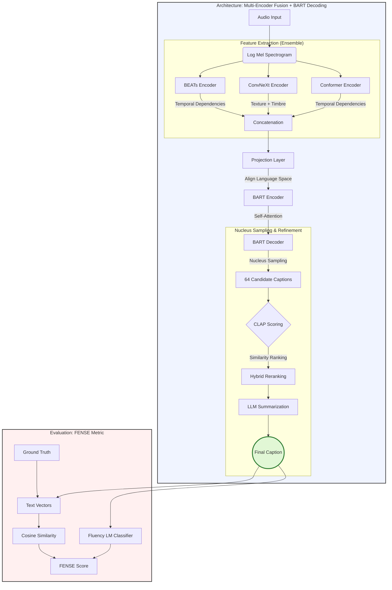

# CoNeTTE: Audio Captioning with Task Embeddings
## ML-CS-GY 6933: Machine Listening (Spring 2026)
**Instructor:** Juan Pablo Bello  
**TA:** Julia Wilkins

---


## 🎙️ Project Overview
This project focuses on improving **CoNeTTE**, a state-of-the-art system for **Automated Audio Captioning (AAC)**. The goal of AAC is to generate descriptive, natural language summaries of audio content, bridging the gap between raw signal processing and semantic understanding.

CoNeTTE (CNext-trans) is designed for high efficiency and performance, achieving competitive results with significantly fewer parameters than traditional ensemble-based systems.

---

## 🏗️ Core Architecture: CNext-Trans
The model follows an encoder-decoder framework optimized for audio signals:

- **Encoder (ConvNeXt):** Adapted from computer vision, this robust convolutional backbone extracts deep hierarchical features from audio spectrograms.
- **Decoder (Transformer):** A vanilla Transformer decoder, trained from scratch, translates audio features into coherent natural language.
- **Efficiency:** CoNeTTE utilizes **4–40× fewer parameters** than competing systems without sacrificing caption quality.

---

## 🚀 Key Contributions & Findings

### 1. AudioCaps Bias Analysis
The authors identified that **AudioCaps (AC)** files are drawn entirely from the AudioSet training set. This means many pretrained encoders have "seen" the test data during their own training phases.
- **Impact:** This leak causes a modest **~5% SPIDEr score inflation**.
- **Takeaway:** Benchmarking must account for pre-training data overlap to accurately assess generalization.

### 2. The Multi-Dataset Challenge
Naïve data mixing (combining AudioCaps, Clotho, MACS, and WavCaps) surprisingly **hurt performance**.
- **The Cause:** Each dataset has distinct writing styles, vocabularies, and sound event emphasis.
- **The Solution:** **Task Embeddings (TE)**.

### 3. Task Embeddings (TE)
By prepending a dataset-specific token (e.g., `<bos_ac>`, `<bos_cl>`) to the decoder:
- **Style Steering:** The model learns to mimic specific dataset styles (sentence length, word choice).
- **Content Shift:** The TEs guide the model on which sound events to prioritize based on the target dataset's characteristics.
- **Performance:** This recovered performance loss from data mixing and significantly improved cross-dataset generalization.

---

## 📊 Results Summary
CoNeTTE remains highly competitive with much larger models:
- **AudioCaps:** 44.1% SPIDEr
- **Clotho:** 30.5% SPIDEr

---

## 🛠️ Implementation Plan (Work in Progress)
> [!NOTE]  
> This README and the implementation plan will be updated regularly as the project progresses.

Our work aims to extend and improve this model for the Spring 2026 Machine Listening final project.

### Planned Enhancements
- [ ] Reproduce baseline CoNeTTE results (ConvNeXt encoder + Transformer decoder + beam search) as our control setup.
- [ ] Evaluate upgraded/switchable encoders, starting with **AST (Audio Spectrogram Transformer)** and additional candidates such as EfficientNet-style audio backbones.
- [ ] Replace or complement beam search with **nucleus sampling (top-p)** to generate diverse caption candidates.
- [ ] Build a multi-candidate decoding pipeline:
  - generate multiple captions with nucleus sampling,
  - rank candidates with automatic metrics and semantic similarity,
  - summarize/select final output with an LLM.
- [ ] Integrate a state-of-the-art LLM as a caption refinement/reranking module (e.g., **GPT-5.4**, **Gemini-family models**), then compare against non-LLM baselines.
- [ ] Benchmark open-source LLM alternatives for the same refinement stage (e.g., **Qwen** and **Gemma** families) to study quality/cost trade-offs.
- [ ] Prototype **multi-encoder fusion** (e.g., ConvNeXt + AST) to combine complementary acoustic representations into a richer decoder input.
- [ ] Investigate fine-tuning strategies for cross-domain adaptation under single-dataset and multi-dataset training.

### Baseline-to-Advanced Experiment Tracks
1. **Encoder Track:** ConvNeXt vs AST vs fused encoders.
2. **Decoder Track:** Beam search vs nucleus sampling vs hybrid decoding.
3. **LLM Track:** No-LLM postprocessing vs proprietary LLM vs open-source LLM.
4. **Generalization Track:** In-domain and cross-dataset evaluation across AudioCaps/Clotho(+).

### Setup & Requirements
```bash
# Clone the repository
git clone https://github.com/robbietylman/Automatic-Audio-Captioning-ML-2026.git
cd Automatic-Audio-Captioning-ML-2026

# Install dependencies
pip install -r requirements.txt
```

---

---

## 🏆 Winning Model

Our final system integrates multiple state-of-the-art components to achieve superior audio-to-text alignment and caption fluency.



### Model Details
- **Audio Processing:** Raw audio is converted into **log mel spectrograms**.
- **Encoder Fusion:** 
    - **Transformer-based (BEATs / Conformer):** Capture long-range temporal dependencies.
    - **CNN-based (ConvNeXt):** Extract local texture and timbre patterns.
    - **Combination:** Encoder outputs are concatenated into a rich representation, far exceeding the capability of any single model.
- **Language Alignment:** Features are projected into **BART's language space** to match expected input dimensions and align audio with language embeddings.
- **Decoding & Generation:**
    - **BART Encoder:** Applies self-attention for global audio understanding.
    - **BART Decoder:** Uses cross-attention to previously generated tokens for next-token prediction.
    - **Nucleus Sampling:** Generates **64 diverse candidate captions**.
- **Refinement Pipeline:**
    - **CLAP Filtering:** Scores similarity between audio and captions, discarding weak matches.
    - **Hybrid Reranking:** Consolidates the best candidates.
    - **LLM Summary:** A final LLM pass summarizes the top results into a single, high-quality caption.

### Evaluation: FENSE
To ensure accuracy and readability, we utilize the **FENSE** metric:
- **Semantic Accuracy:** Converts text into vectors and determines **cosine similarity** against ground truth references.
- **Fluency Metric:** Uses a trained **LM classifier** to assign higher scores to natural human language, penalizing grammatically incorrect or awkward sentences.

---

## 📚 References
> **Paper:** [CoNeTTE: Audio Captioning with Task Embeddings](https://arxiv.org/abs/2309.00454)  
> **Original Implementation:** [Labbé et al. (2023)](https://github.com/paullabbe/CoNeTTE)

---
*Created for the NYU Tandon School of Engineering - CS-GY 6933 Machine Listening.*
